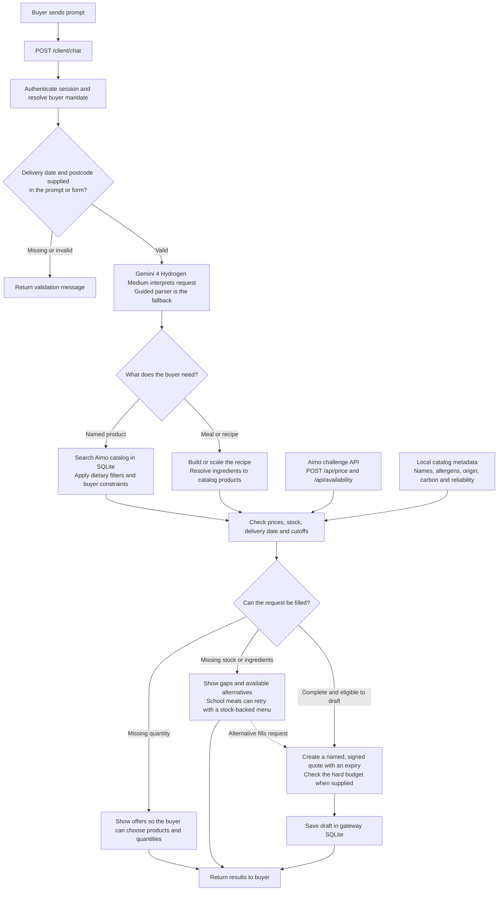

# Build shopping list

```mermaid
flowchart TD
    A["Buyer sends prompt"] --> B["POST /client/chat"]
    B --> C["Authenticate session and resolve buyer mandate"]
    C --> D{"Delivery date and postcode supplied<br/>in the prompt or form?"}
    D -->|Missing or invalid| E["Return validation message"]
    D -->|Valid| F["Gemini 4 Hydrogen Medium interprets request<br/>Guided parser is the fallback"]
    F --> G{"What does the buyer need?"}
    G -->|Named product| H["Search Aimo catalog in SQLite<br/>Apply dietary filters and buyer constraints"]
    G -->|Meal or recipe| I["Build or scale the recipe<br/>Resolve ingredients to catalog products"]
    H --> J["Check prices, stock, delivery date and cutoffs"]
    I --> J
    K["Aimo challenge API<br/>POST /api/price and /api/availability"] --> J
    L["Local catalog metadata<br/>Names, allergens, origin, carbon and reliability"] --> J
    J --> M{"Can the request be filled?"}
    M -->|Missing quantity| N["Show offers so the buyer can choose products and quantities"]
    M -->|Missing stock or ingredients| O["Show gaps and available alternatives<br/>School meals can retry with a stock-backed menu"]
    M -->|Complete and eligible to draft| P["Create a named, signed quote with an expiry<br/>Check the hard budget when supplied"]
    N --> Q["Return results to buyer"]
    O --> Q
    O -. Alternative fills request .-> P
    P --> R["Save draft in gateway SQLite"]
    R --> Q
```

A draft freezes quoted prices until expiry and does not reserve stock.

[Prompt handler](../../app/gateway/portal_chat.py) · [Offer lookup](../../app/gateway/offers.py)
